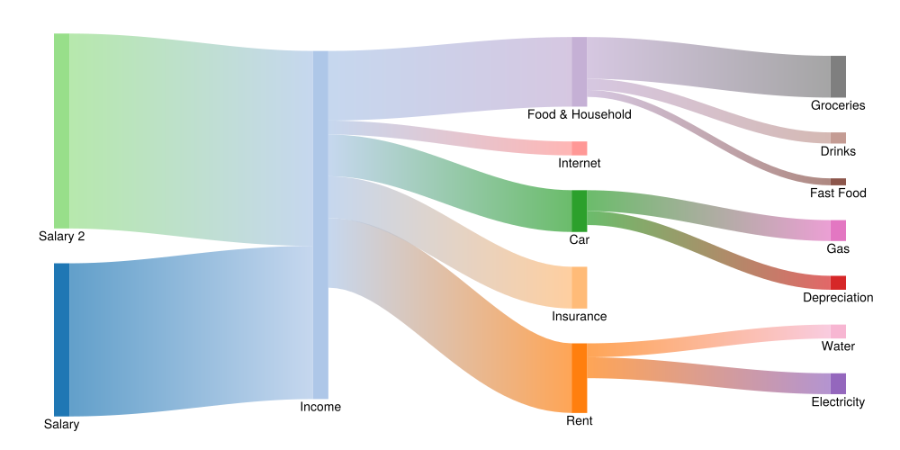

<div align="center">
    <picture>
      <source media="(prefers-color-scheme: dark)" 
        srcset="docs/src/assets/logo_with_text_dark.svg" >
      
    </picture>
</div>

A Makie port of [https://github.com/daschw/SankeyPlots.jl](https://github.com/daschw/SankeyPlots.jl)

## Example



```julia
using SankeyMakie
using CairoMakie
using Random

connections = [
    (1, 2, 1100),
    (2, 4, 300),
    (6, 2, 1400),
    (2, 3, 500),
    (2, 5, 300),
    (5, 7, 100),
    (2, 8, 100),
    (3, 9, 150),
    (2, 10, 500),
    (10, 11, 50),
    (10, 12, 80),
    (5, 13, 150),
    (3, 14, 100),
    (10, 15, 300),
]

labels = [
    "Salary",
    "Income",
    "Rent",
    "Insurance",
    "Car",
    "Salary 2",
    "Depreciation",
    "Internet",
    "Electricity",
    "Food & Household",
    "Fast Food",
    "Drinks",
    "Gas",
    "Water",
    "Groceries",
]

sankey(connections,
    nodelabels = labels,
    nodecolor = Makie.to_colormap(:tab20)[1:length(labels)],
    linkcolor = SankeyMakie.Gradient(0.7),
    axis = hidden_axis(),
    figure = (; size = (1000, 500))
)
```